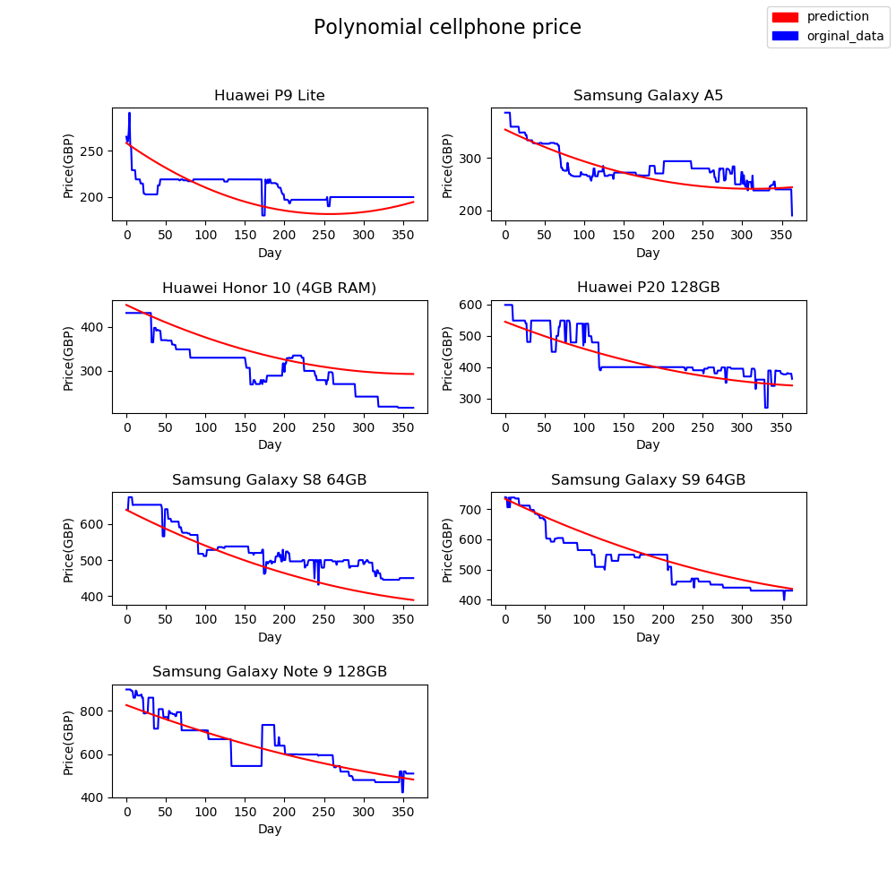
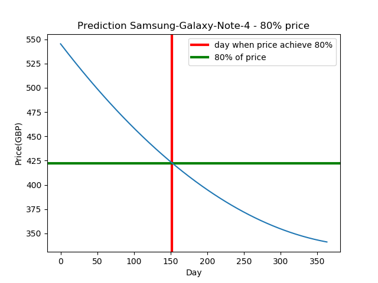
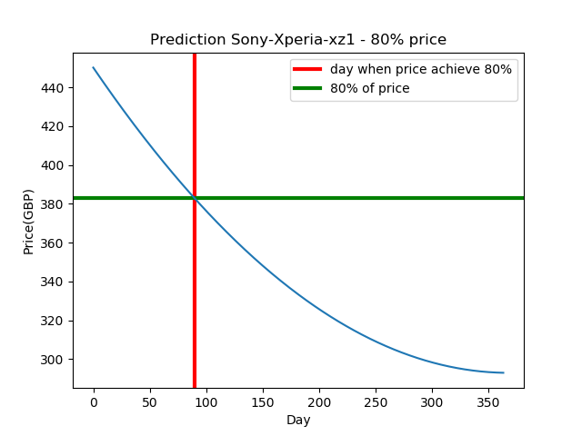

 # WhenShouldiBuy  
 analyze and predict after how many days  
 from premiere of mobile phone price is drop to80% from start price  
 Historical Price data are from https://pricespy.co.uk.  
 Prices are in British pounds.
 
 - Polynomial regression is used
 - 7 price ranges used(image below)
 
 
 
Results : 
 **RMSE** of polynomial regression is 1734.4589431839693  
 **R2** of polynomial regression is 0.9333360342522857

For new data 
Prediction_1 for  samsung galaxy note 4
Begining price: 528 
percent_treshold 80%:  
Begining price( 528 )  should drop to 80% ( 421.96564126781067 )  after  **153** days
error aprox: 10 % 
 

Prediction_2 for  sony xperia xz1
Begining price: 479 
percent_treshold 80%:  
Begining price( 479 )  should drop to 80% ( 382 )  after  **90** days
error aprox: 4 % 
 

**TO DO:**  
- convert prices to PLN
- improve model
- clean code  
- make tests  
- error handling
- GUI
- pep8