 # cnn wroclaw landmarks

Applications to recognize Wrocław the most popular Landmarks using convolutional neural network 

**Tags:** convolutional neural network, Transfer Learning,  Keras, TensorFlow, MobileNet 
 

Results: 
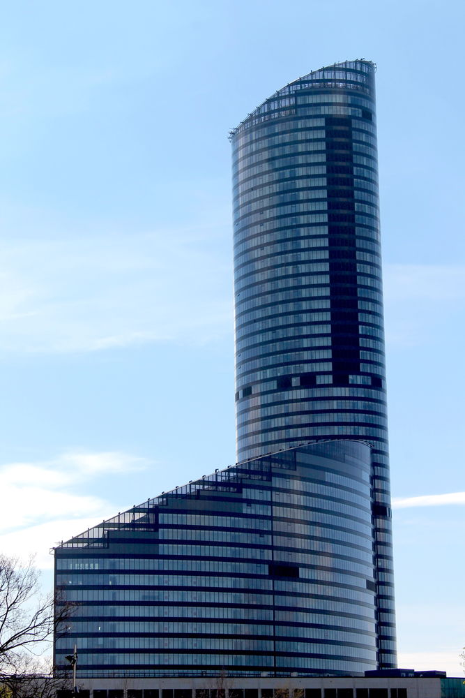
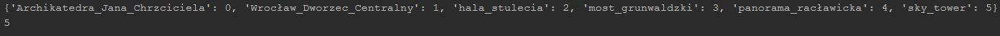
 
**Results: 5 - sky_tower**
  
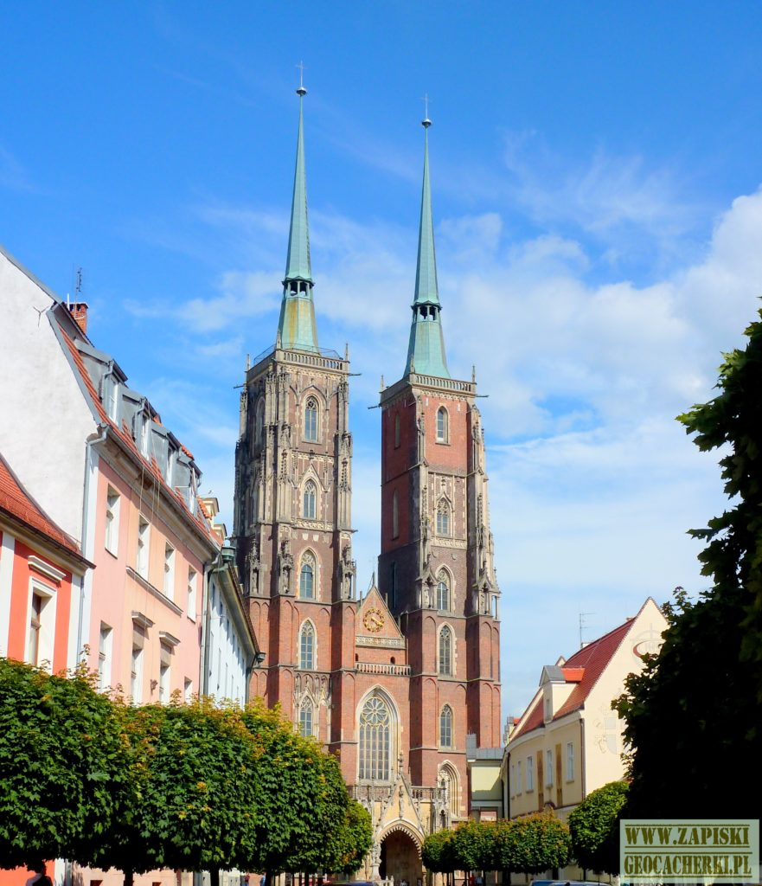
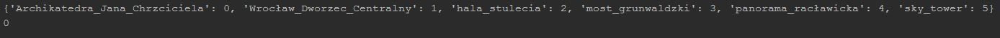
 
**Results: 0 - Archikatedra_Jana_Chrzciciela**
  
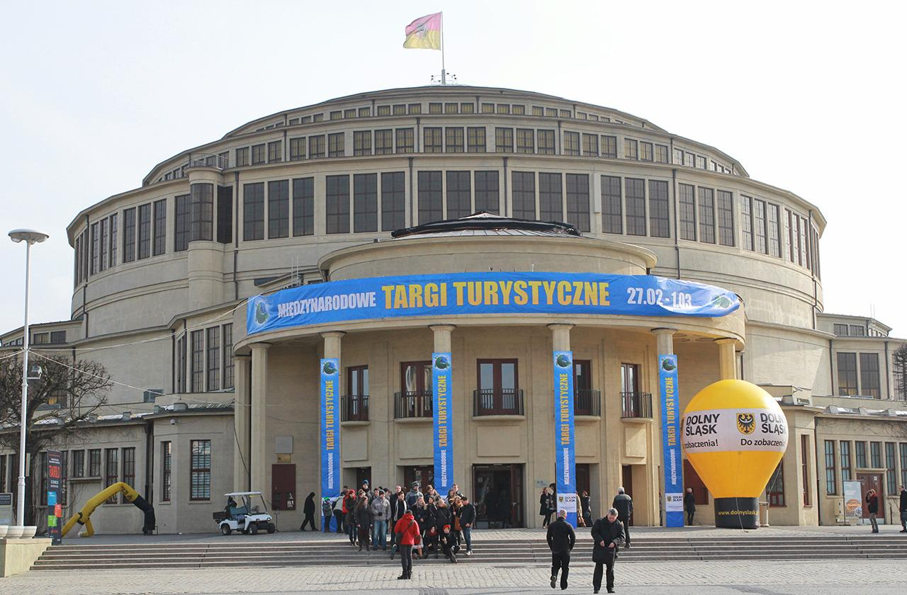
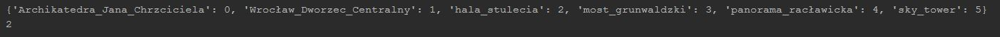
 
**Results: 2 - hala_stulecia**
  
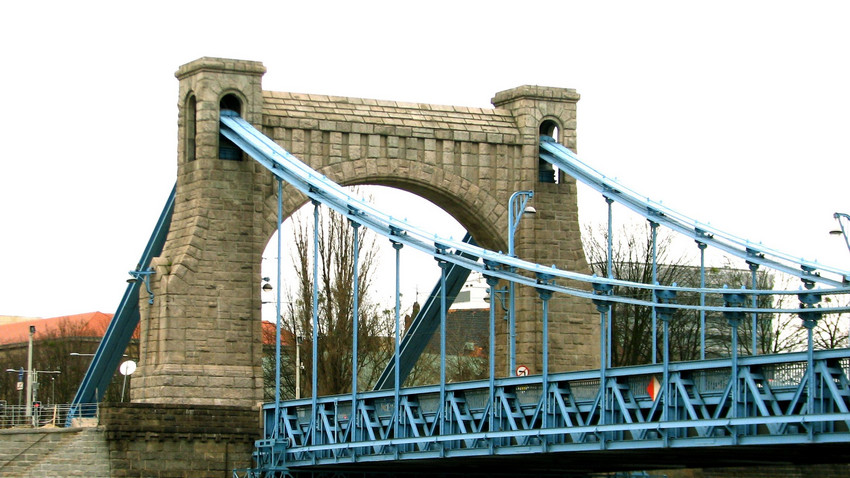
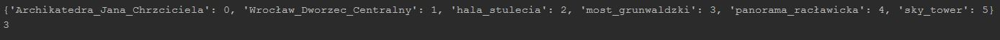
 
**Results: 3 - most_grunwaldzki**
  
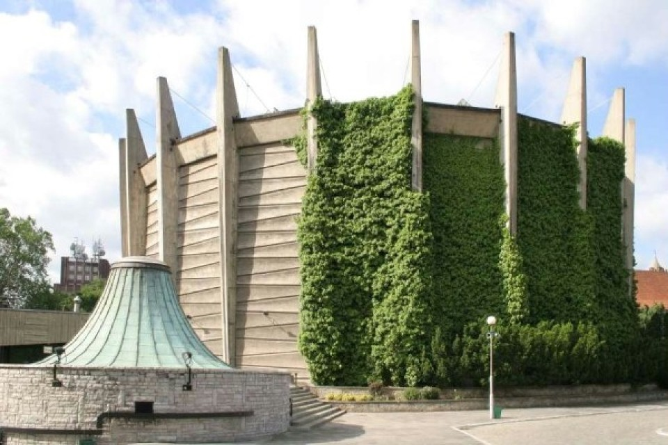
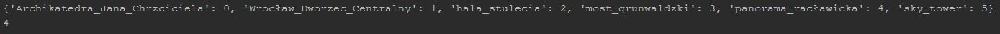
 
**Results: 4 - panorama_raclawicka**
  
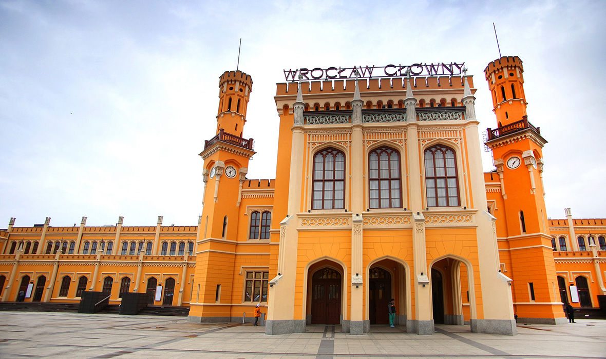
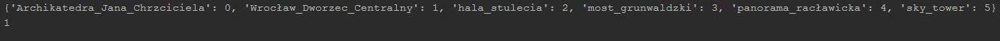
 
**Results: 1 - Wroclaw_Dworzec_centralny**