 # cnn wroclaw landmarks

Applications to recognize the most popular Landmarks in Wrocław using convolutional neural network 
 
Images to train downloaded,  using  chrome plugin "FATKUN" and google graphic search
(381 images belonging to 6 classes)
 
 
**Tags:** convolutional neural network, Transfer Learning,  Keras, TensorFlow, MobileNet 
 

Results: 
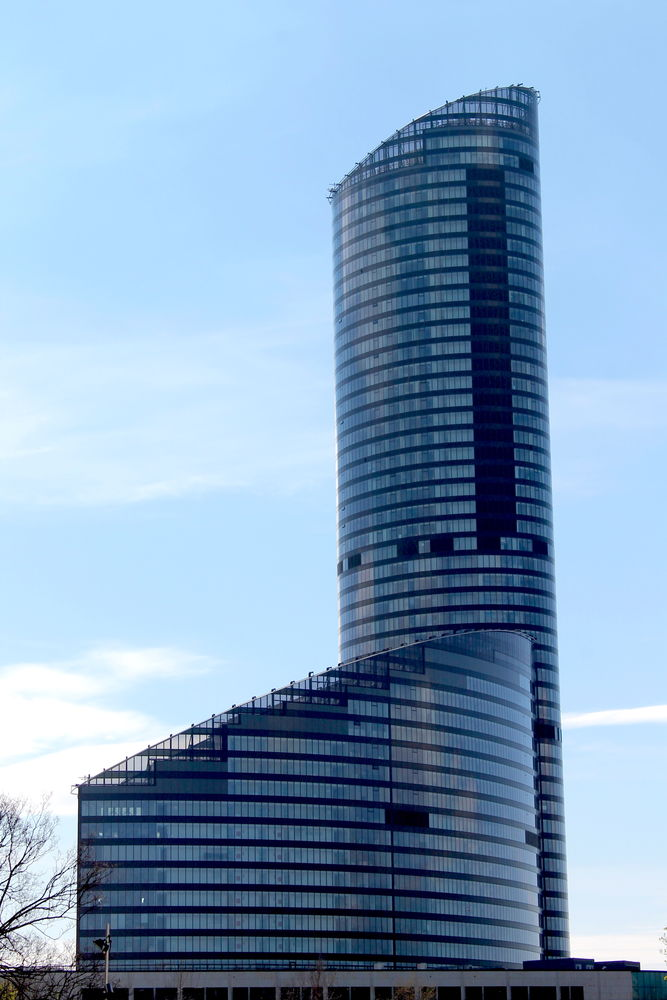
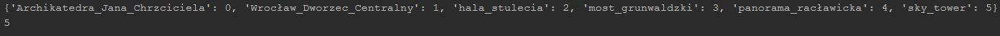
 
**Result: class 5 - sky_tower**
  
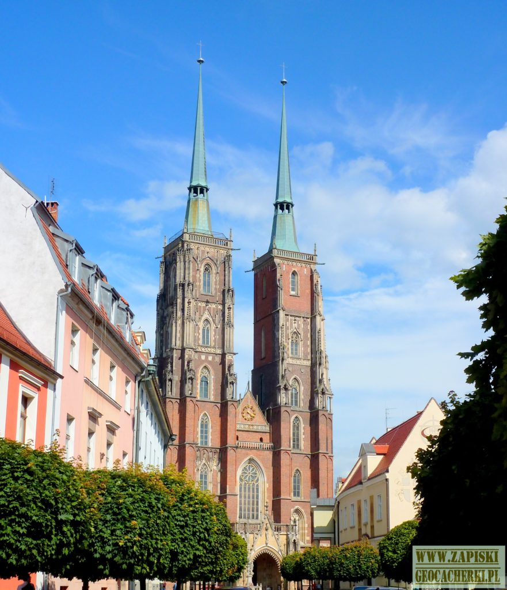
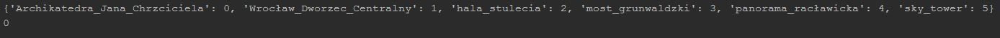
 
**Result: class 0 - Archikatedra_Jana_Chrzciciela**
  
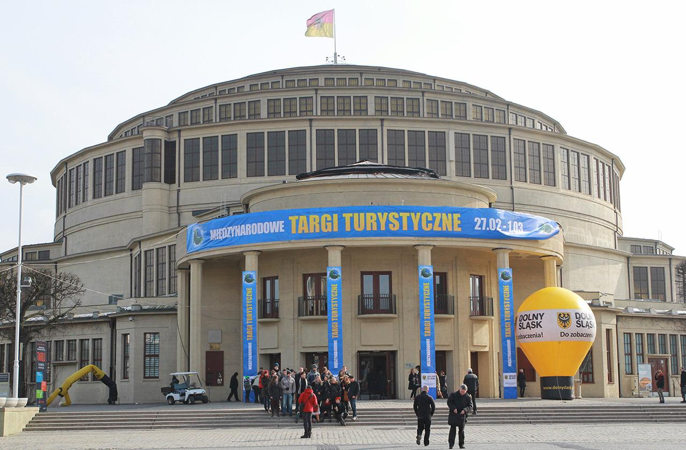
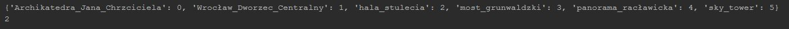
 
**Result: class 2 - hala_stulecia**
  
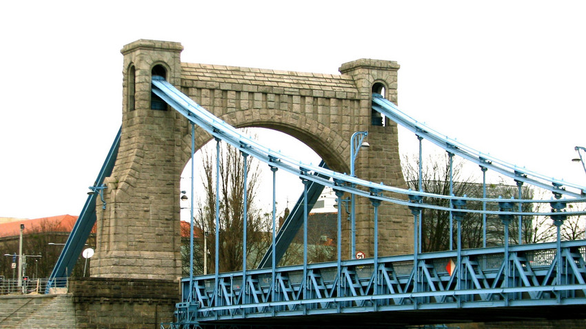
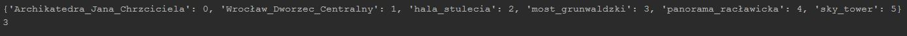
 
**Result: class 3 - most_grunwaldzki**
  

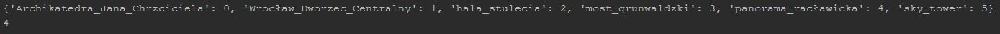
 
**Result: class 4 - panorama_raclawicka**
  
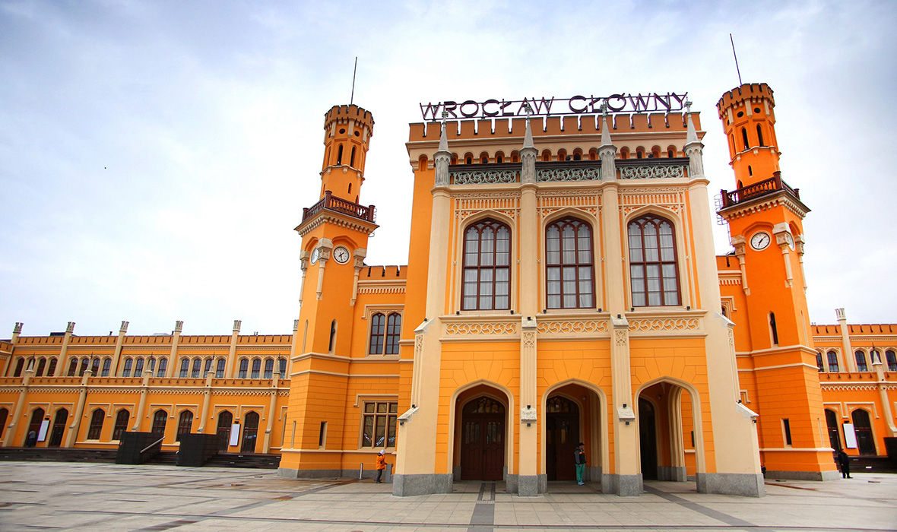
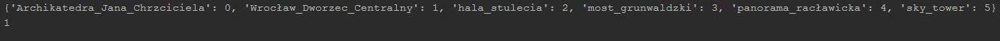
 
**Result: class 1 - Wroclaw_Dworzec_centralny**